# Capsule — Personal EHR Vault: Architecture Document v1.0

**Status:** Draft  
**Date:** 2026-04-03  
**Repo:** healthkey-ai/phr  
**PRD:** `capsule.prd.md`

---

## 1. System Overview

Capsule is a zero-knowledge health record vault. The operator hosts infrastructure; patients hold the only decryption keys. No plaintext PHI is ever stored on operator servers.

The architecture has five layers:

```
┌─────────────────────────────────────────────────────────┐
│  PATIENT BROWSER / DEVICE                                │
│  ┌────────────────────────────────────────────────────┐ │
│  │  Web Crypto API (AES-GCM-256)  │  Shamir Key Mgmt  │ │
│  │  FHIR Client (SMART on FHIR)   │  Timeline UI       │ │
│  └────────────────────────────────────────────────────┘ │
└──────────────────────────┬──────────────────────────────┘
                           │  TLS 1.3 — ciphertext only
┌──────────────────────────▼──────────────────────────────┐
│  CAPSULE API SERVER (Node.js / Go)                       │
│  ┌──────────────┐  ┌─────────────┐  ┌────────────────┐  │
│  │ Auth Service │  │ Blob Store  │  │ Metadata Store │  │
│  │ (JWT, OAuth2)│  │ API (S3/GCS)│  │ (PostgreSQL)   │  │
│  └──────────────┘  └─────────────┘  └────────────────┘  │
└──────────────────────────┬──────────────────────────────┘
                           │
┌──────────────────────────▼──────────────────────────────┐
│  STORAGE LAYER (cloud-agnostic)                          │
│  ┌────────────────────────┐  ┌───────────────────────┐  │
│  │  Object Storage        │  │  PostgreSQL            │  │
│  │  (S3 / GCS / Azure BS) │  │  (metadata, sessions,  │  │
│  │  encrypted blobs only  │  │   audit logs)          │  │
│  └────────────────────────┘  └───────────────────────┘  │
└─────────────────────────────────────────────────────────┘
```

---

## 2. Key Management Architecture

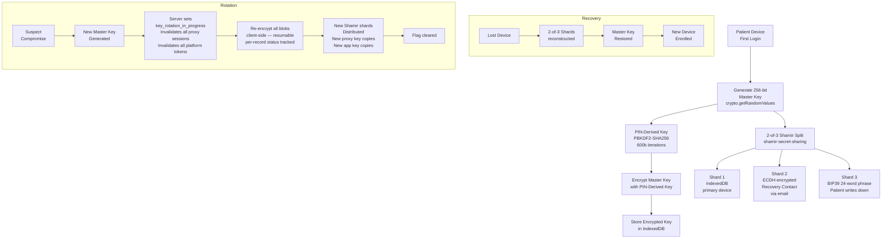

### Key Protection Threat Model

| Threat | Mitigation |
|--------|------------|
| Server compromised | Attacker gets ciphertext only — no key material held by server |
| Server subpoena | Zero key shards on server; legal compulsion cannot produce plaintext |
| Device stolen | Shard 1 in IndexedDB protected by PIN-derived key (PBKDF2, 600k iterations); attacker needs PIN |
| Shard 2 email intercepted | Shard 2 encrypted with recovery contact's ECDH public key; interceptor cannot decrypt without contact's private key |
| Shard 3 phrase stolen | Any 2-of-3 is needed; one shard alone is insufficient |
| XSS attack in browser | Strict CSP, SRI on all assets; no inline scripts |
| Operator employee | No key material on server; operator literally cannot read patient data |

---

## 3. Encryption Data Flow

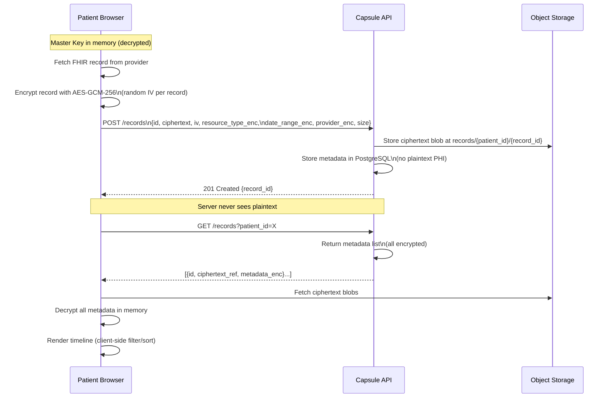

---

## 4. SMART on FHIR Provider Connection

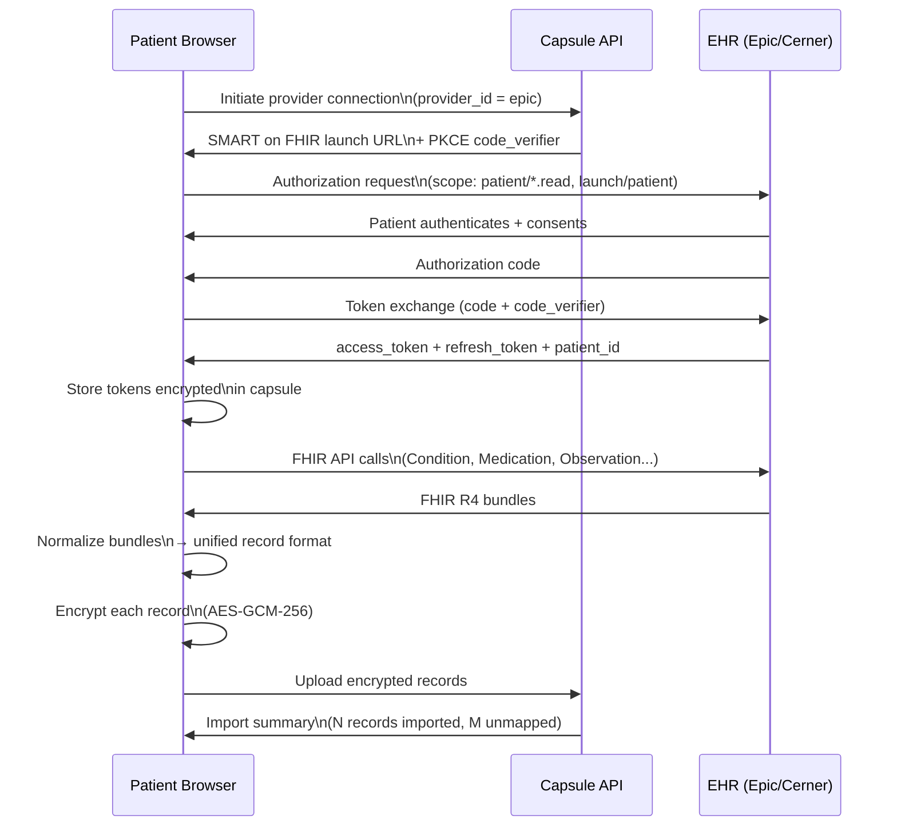

---

## 5. Doctor Share Link Flow

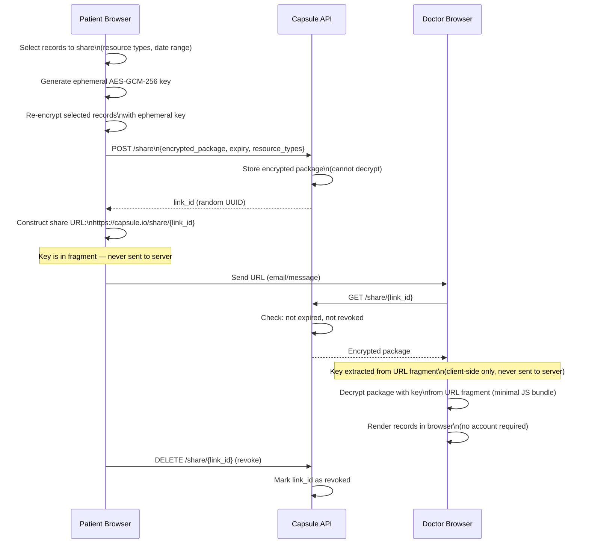

---

## 6. Caregiver Proxy Key Delegation

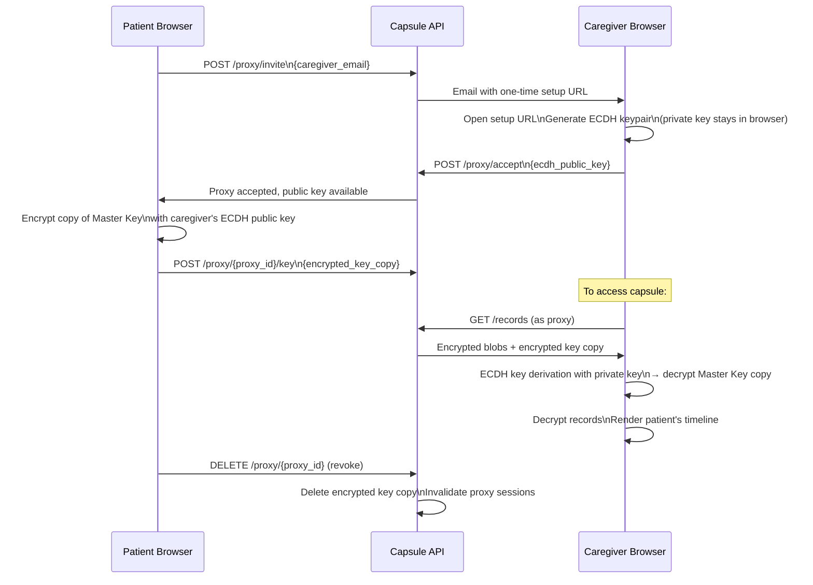

---

## 7. Conflict Detection Pipeline

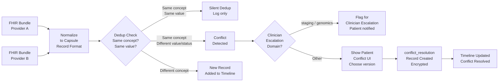

---

## 8. Platform API (OAuth2)

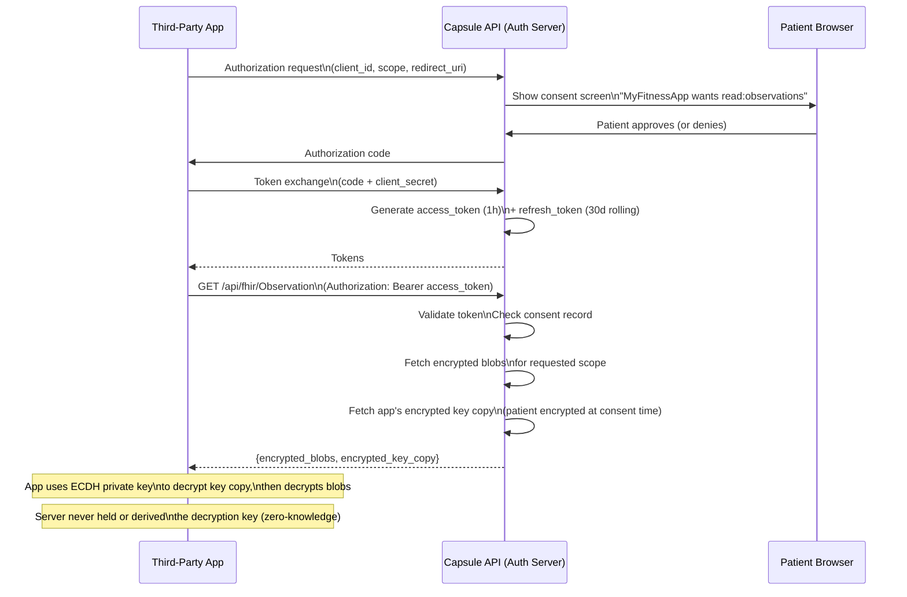

---

## 9. Emergency Access QR Code

```mermaid
flowchart TD
    A[Patient generates\nEmergency QR] --> B[Select emergency fields:\nblood type, allergies,\nmeds, conditions, contacts]
    B --> C[Generate ephemeral key]
    C --> D[Encrypt selected fields\nwith ephemeral key]
    D --> E[Store encrypted payload\non server at /emergency/ID]
    E --> F[QR encodes URL:\nhttps://capsule.io/e/ID#KEY]
    F --> G[Patient saves/prints QR]

    H[First Responder\nscans QR] --> I[Browser opens URL]
    I --> J[GET /emergency/ID\nfrom server]
    J --> K[Decrypt with KEY\nfrom URL fragment]
    K --> L[Render emergency info page\n(minimal self-contained JS bundle\nno framework, no CDN dependencies)]

    M[Patient regenerates QR] --> N[Old ID → 410 Gone]
    N --> O[New ID + New Key\nIssued]
```

---

## 10. Database Schema (PostgreSQL — metadata only, no PHI)

```mermaid
erDiagram
    patients {
        uuid id PK
        string email_hash
        string auth_hash
        timestamp created_at
        boolean key_rotation_in_progress
        timestamp key_rotation_started_at
    }

    records {
        uuid id PK
        uuid patient_id FK
        string ciphertext_ref
        bytes iv
        string resource_type_enc
        int date_week_bucket
        string provider_id_enc
        int ciphertext_size_bytes
        timestamp imported_at
    }

    providers {
        uuid id PK
        uuid patient_id FK
        bytes provider_name_enc
        bytes fhir_base_url_enc
        bytes refresh_token_enc
        timestamp token_expires_at
        string status
    }

    share_links {
        uuid id PK
        uuid patient_id FK
        string encrypted_package_ref
        timestamp expires_at
        boolean revoked
        string resource_types_enc
        timestamp created_at
    }

    share_link_access_log {
        uuid id PK
        uuid link_id FK
        timestamp accessed_at
        string ip_hash
    }

    proxies {
        uuid id PK
        uuid patient_id FK
        string caregiver_email_hash
        bytes encrypted_key_copy
        bytes caregiver_ecdh_public_key
        boolean revoked
        timestamp created_at
    }

    conflicts {
        uuid id PK
        uuid patient_id FK
        uuid record_a_id FK
        uuid record_b_id FK
        string conflict_type
        string status
        timestamp detected_at
        timestamp resolved_at
    }

    audit_log {
        uuid id PK
        string patient_id_hash
        string action
        string resource_types
        string provider_id
        timestamp created_at
    }

    emergency_access {
        uuid id PK
        uuid patient_id FK
        string encrypted_payload_ref
        bytes iv
        boolean revoked
        timestamp created_at
    }

    research_consent {
        uuid id PK
        uuid patient_id FK
        string category
        boolean granted
        boolean genomics_disclosure_acknowledged
        timestamp granted_at
        timestamp revoked_at
    }

    platform_clients {
        uuid id PK
        string client_id
        string client_secret_hash
        string redirect_uris
        string allowed_scopes
        bytes ecdh_public_key
        timestamp created_at
    }

    platform_app_keys {
        uuid id PK
        uuid patient_id FK
        uuid client_id FK
        bytes encrypted_key_copy
        string scopes_at_grant_time
        timestamp granted_at
        timestamp key_rotation_version
    }

    platform_tokens {
        uuid id PK
        uuid patient_id FK
        uuid client_id FK
        uuid app_key_id FK
        string access_token_hash
        string refresh_token_hash
        string scopes
        timestamp access_expires_at
        timestamp refresh_expires_at
    }

    patients ||--o{ records : has
    patients ||--o{ providers : connected
    patients ||--o{ share_links : creates
    share_links ||--o{ share_link_access_log : logged
    patients ||--o{ proxies : grants
    patients ||--o{ conflicts : detected
    patients ||--o{ audit_log : logged
    patients ||--o{ emergency_access : configures
    patients ||--o{ research_consent : sets
    patients ||--o{ platform_tokens : authorizes
    platform_clients ||--o{ platform_tokens : issued
```

---

## 11. Component Architecture

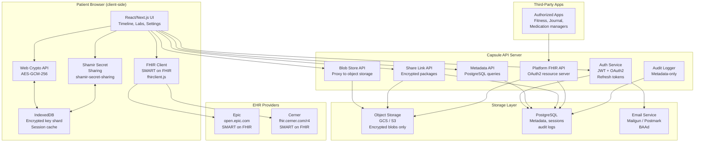

---

## 12. Deployment Architecture (V1: Single Cloud)

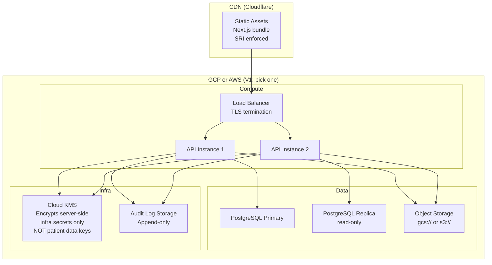

**Note on KMS:** Cloud KMS is used ONLY for encrypting infrastructure secrets (database credentials, service account keys, API keys). It is NOT used for patient data. Patient data keys are never sent to the server — they exist only in the patient's browser/device.

---

## 13. Security Architecture

### Authentication Flow

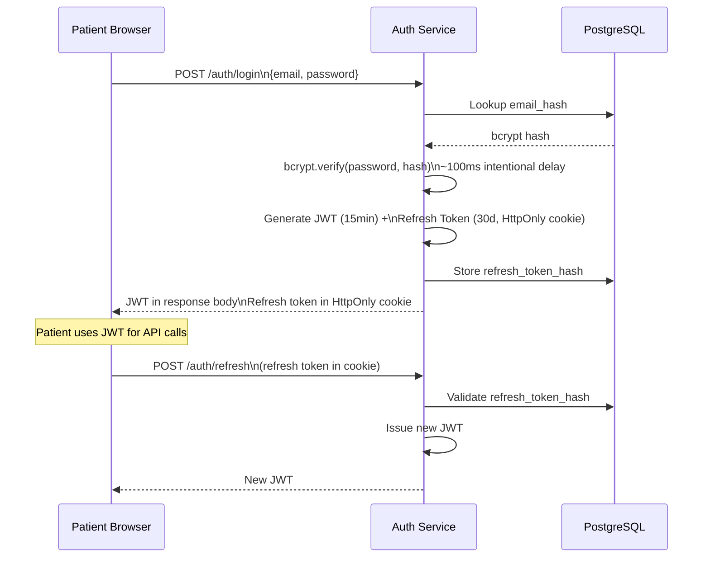

### Authorization Rules

| Route | Who Can Access | Key Enforcement |
|-------|---------------|-----------------|
| `GET /records` | Patient, Caregiver proxy | JWT + patient_id match |
| `GET /share/:id` | Anyone with valid link | Link not expired, not revoked |
| `GET /emergency/:id` | Anyone with valid URL | Not revoked |
| `GET /api/fhir/*` | Authorized 3rd-party apps | OAuth2 access token + consent check |
| `GET /research/query` | Approved researchers | Researcher role token + patient consent |
| `DELETE /proxy/:id` | Patient only | JWT + patient_id must own proxy |
| `POST /keys/*` | Patient only | JWT + patient_id |

---

## 14. Error Handling Map

| Failure | Error Class | User Experience | Logged? |
|---------|-------------|-----------------|---------|
| FHIR provider returns 401 | `FHIROAuthExpired` | "Epic connection needs re-authorization" + button | Yes (metadata) |
| FHIR provider returns 429 | `FHIRRateLimited` | Retry with backoff (silent if < 3 retries); notify if all fail | Yes |
| FHIR bundle malformed | `FHIRParseError` | "Some records could not be imported" + count | Yes (unmapped_resource_log) |
| Web Crypto encrypt fails | `CryptoError` | "Encryption failed — your data was not saved" | Yes (anonymized) |
| Key reconstruction fails | `ShamirReconstructError` | "Key recovery failed — check your recovery phrase" | No (privacy) |
| Share link expired | `LinkExpired` | "This link has expired. Ask the patient for a new one." | Yes |
| Share link revoked | `LinkRevoked` | 404 — no indication of revocation vs. non-existence | Yes |
| Key rotation interrupted | `RotationIncomplete` | On next load: "Key rotation was interrupted. Resume?" | Yes |
| Blob fetch timeout | `BlobTimeout` | Partial timeline shown with "Some records unavailable" | Yes |
| Research query too small | `CohortTooSmall` | "Cohort has fewer than 10 patients — no results returned" + privacy advisory | Yes |

---

## 15. Technology Choices

| Component | Choice | Rationale |
|-----------|--------|-----------|
| Frontend | Next.js (React) | SSR for static pages, CSR for crypto-heavy views |
| Encryption | Web Crypto API (`SubtleCrypto`) | Browser-native, no dependency, auditable |
| Shamir library | `shamir-secret-sharing` npm (v2.x) | MIT license, actively maintained |
| FHIR client | `fhirclient` npm | SMART on FHIR reference implementation |
| Database | PostgreSQL | Relational, ACID, row-level security for multi-tenant isolation |
| Object storage | GCS or S3 | Cloud-agnostic blob storage; Terraform-switchable for V2 |
| Auth | JWT (short-lived) + HttpOnly refresh cookie | Industry standard; mitigates XSS token theft |
| Email | Mailgun or Postmark (BAA required) | Transactional email for Shard 2 delivery + account management |
| CDN | Cloudflare | SRI enforcement, DDoS protection, TLS termination |
| Infrastructure | Terraform (V1: single cloud module) | V2 adds multi-cloud modules |

---

## 16. V2 Architecture Extensions (Design Accommodated)

The following are NOT in V1 but the schema and API surface are designed to support them:

- **Multi-cloud Terraform:** V1 deploys to one cloud. Object storage client is abstracted behind a provider interface in V1 (enabling swap without API changes) — see NFR in PRD. V2 adds `aws/` and `azure/` Terraform modules.
- **Mobile:** React Native wrapping the same Web Crypto client. IndexedDB → AsyncStorage. Same key management flow.
- **Push model:** `push_requests` table is not in V1 schema but the `providers` table has a `status` field that can represent "push-authorized." Push approval UI is V2.
- **WebAuthn PRF key protection:** V1 uses PIN-derived key (PBKDF2). V2 upgrades Shard 1 protection to WebAuthn PRF extension once browser support exceeds 85%.
- **Open-source client library:** The encryption/decryption logic in `lib/crypto.ts` is designed to be extracted as a standalone npm package. No server dependencies in that module.

---

## 17. Prototype Plan (48 Hours, Before V1 Sprint)

**Goal:** Validate two architectural bets before committing to a sprint:
1. Can FHIR bundles from Epic sandbox and Cerner sandbox be normalized into a unified timeline without heroic data cleaning?
2. Does client-side AES-GCM encryption work in the browser without UX-breaking friction?

**Stack:** Next.js (local), no database, no auth.

**What to build:**
1. SMART on FHIR OAuth flow against `open.epic.com`
2. SMART on FHIR OAuth flow against `fhir.cerner.com/r4`
3. Pull Condition, MedicationRequest, Observation from both
4. Normalize into a single `{date, type, provider, summary}` array
5. Render as a flat timeline list
6. Encrypt one record client-side with Web Crypto AES-GCM, decrypt, verify round-trip

**Decision gate:**
- If normalization requires < 2 weeks of work: FHIR pull is V1
- If normalization requires > 4 weeks: document upload is V1, FHIR pull is V2

**What to skip:** auth, database, key management, UI polish, anything not needed to answer the two questions above.
